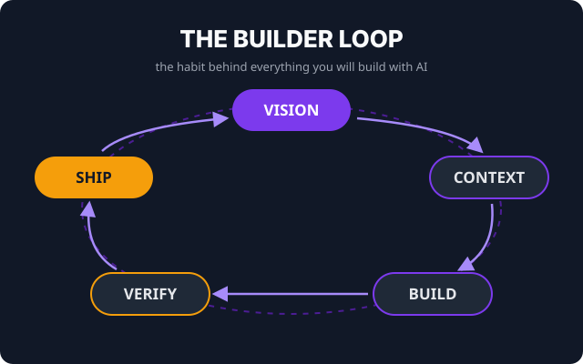

<div align="center">


<h1>Build With AI</h1>

<p><strong>The free, open-source agentic AI course — from curious to shipping, built for the culture. ⚡</strong></p>

<p><em>54 lessons &nbsp;·&nbsp; 11 chapters &nbsp;·&nbsp; 2 learning lanes &nbsp;·&nbsp; course materials free and open</em></p>

<p>
  <a href="https://thetechhustle.github.io/learn_ai/">
    
  </a>
  
  
  <a href="LICENSE">
    
  </a>
  <a href="https://github.com/thetechhustle/learn_ai/stargazers">
    
  </a>
</p>

<br/>

<a href="https://thetechhustle.github.io/learn_ai/"><strong>🚀 Launch the Course</strong></a>
&nbsp;&nbsp;·&nbsp;&nbsp;
<a href="https://thetechhustle.github.io/learn_ai/course/syllabus/"><strong>📚 View the Syllabus</strong></a>
&nbsp;&nbsp;·&nbsp;&nbsp;
<a href="https://thetechhustle.github.io/learn_ai/course/join/"><strong>🎟️ Join the Cohort</strong></a>
&nbsp;&nbsp;·&nbsp;&nbsp;
<a href="#-contribute--community"><strong>🤝 Contribute</strong></a>

<br/><br/>



</div>

---

## For the culture 🔥

If you use AI in a chat window and want to test tool-using agents on bounded,
reviewable work, this course was built with you in mind.

Agent tools add files, commands, services, and multi-step execution to language
models. That can make useful work possible and can create new failure, privacy,
security, and operating risks. The course teaches you to direct and evaluate that
work without promising a business or career outcome.

This is a structured, two-lane path with a beginner route and a deeper engineer
route. The repository is currently free to access and licensed under MIT; future
hosting, third-party tools, accounts, and service plans can have separate costs.

> **The Tech Hustle** is about closing the knowledge gap. We build what should have already existed.

---

## 🎯 Who Is This For?

| If you are... | This course gives you... |
|---|---|
| 🌱 **Curious, not technical** | A supported beginner lane with setup, simulation, vocabulary, and recovery paths |
| 💼 **Creator / entrepreneur** | A process for testing a bounded idea before deciding what expert help it needs |
| 👩‍💻 **Software engineer** | The full agentic stack — context engineering, Skills, MCP, hooks, agent teams |
| 📊 **Data / IT / ops professional** | Agent direction and trust-boundary practice grounded in existing domain knowledge |
| 🚀 **Career switcher** | Reviewable project evidence to compare with actual role requirements |

**No coding experience required for the no-code lane.** If you can type in a browser and follow a recipe, you're ready.

---

## 🧠 The Builder Loop

Every lesson uses the same five-step practice:

```
Vision  →  Context  →  Build  →  Verify  →  Ship
```

You will **decide what done looks like**, engineer the needed context, direct a
bounded build, verify it with relevant human and automated checks, and choose a
public or private review surface. Those are inspectable practices, not a guarantee
of trust, payment, employment, or product success.

---

## 📚 What's Inside

### Four tracks — one continuous path

```
┌────────────────────────────────────────────────────────────────────┐
│  TRACK 1 · Foundations                        Chapters  1–3        │
│  The Agentic Shift · How AI Actually Works                         │
│  Terminal · Git · Claude Code Setup                                │
├────────────────────────────────────────────────────────────────────┤
│  TRACK 2 · Context Engineering                Chapters  4–6        │
│  The Agentic Loop · CLAUDE.md · Memory Layers                      │
│  Second Brain · Everyday Builds                                    │
├────────────────────────────────────────────────────────────────────┤
│  TRACK 3 · Agentic Engineering                Chapters  7–9        │
│  Skills · MCP & Tools · Hooks                                      │
│  Validation · Guardrails · Safety                                  │
├────────────────────────────────────────────────────────────────────┤
│  TRACK 4 · Orchestration & Shipping           Chapters 10–11       │
│  Subagents · Agent Teams · Worktrees                               │
│  Deployment · Costs · Selling What You Build                       │
└────────────────────────────────────────────────────────────────────┘
```

<details>
<summary><strong>📋 All 11 Chapters — click to expand</strong></summary>

<br/>

| # | Chapter | Key Skills |
|---|---|---|
| 01 | The Shift: Welcome to the Agentic Era | Why now, chatbots vs agents, the opportunity, how to run this course |
| 02 | How AI Actually Works | LLMs in plain language, tokens, context windows, strengths and limits, choosing tools |
| 03 | Your Command Center | Terminal confidence, files and paths, Git safety net, Claude Code first session |
| 04 | The Agentic Loop | Gather–act–verify, plan mode, reading diffs, verification habits |
| 05 | Context Engineering | CLAUDE.md, memory layers, second brain, long sessions, big codebases |
| 06 | Everyday Workflows | Slash commands, idea → live site, existing codebases, debugging, non-code work |
| 07 | Skills | What Skills are, anatomy, writing your first, building a Skill library |
| 08 | MCP: Give Your Agent Hands | Why agents need tools, MCP in plain language, first server, CLIs, trust boundaries |
| 09 | Hooks and Guardrails | Hooks, agentic validation, permissions, safety rails |
| 10 | Agent Teams | Subagents, Git worktrees, parallel development, agentic harnesses |
| 11 | Ship It and Sell It | Deployment, production workflows, cost strategy, selling your work, staying current |

</details>

---

## ⏱️ Time Commitment

| Route | Included work | Planning range |
|---|---|---:|
| Reading/reference | 54 lessons and unscored understanding questions | 12–18 hours |
| Assessed practice | Reading, setup or simulation, diagnostics, essential practice, 11 checkpoints, scoring, and revision | 30–50 hours |
| Assessed practice + capstone | Assessed route plus a scoped capstone and peer review | 40–75+ hours |

Videos, repeated "Try it now" builds, extra tool experiments, and portfolio polish
are optional extensions and commonly add 15–30+ hours. These ranges are planning
estimates from the July 23, 2026 course inventory, not finish-time or outcome
promises. See the [course overview](https://thetechhustle.github.io/learn_ai/course/overview/#time-expectations-and-routes)
for route definitions and pause points.

---

## ⚡ Quick Start

**Option 1 — Read on the web (no setup needed)**

👉 **[thetechhustle.github.io/learn_ai](https://thetechhustle.github.io/learn_ai/)**

<br/>

**Option 2 — Run the course locally**

```bash
# Clone
git clone https://github.com/thetechhustle/learn_ai.git
cd learn_ai

# Install and serve
make install
make serve
```

Then open **[http://127.0.0.1:8000](http://127.0.0.1:8000)** in your browser. Full search, dark mode, and offline reading — all included.

<br/>

**Option 3 — Build a static copy**

```bash
mkdocs build --strict
# Output goes to site/
```

---

## 🏁 Lesson Structure

Every lesson answers five questions:

1. **What is this concept?** — Plain language first, precision second
2. **Why does it matter to a builder?** — The money, the time, or the risk it touches
3. **What does it look like in a real session?** — Actual commands, actual output
4. **What can you build with it right now?** — Hands-on, scoped, with an explicit recovery boundary
5. **How do you know it worked?** — Verification is a step, not a vibe

Where the lanes genuinely differ, lessons split into tabbed **🌱 no-code** and **⚙️ engineer** sections — read yours, skim the other.

---

## 🎓 Capstone Project

When you reach the end, the [capstone](https://thetechhustle.github.io/learn_ai/course/capstone/) challenges you to:

- Take a real project from vision brief to **reviewable deployment or demo**
- Engineer the context: a CLAUDE.md that makes your agent a teammate
- Use or deliberately decline equivalent context, tool, and guardrail mechanisms
- Verify the work end-to-end — on a device that isn't yours, for a person that isn't you
- Produce a handoff document and a build log with usage evidence and honest cost estimates

No central submission is required. Use the rubric and a peer review to produce
evidence you can inspect and selectively share. Private, authenticated, recorded,
or synthetic delivery is valid when public release would be unsafe or inappropriate.

---

## 🛠️ Working Safely with Agents

> An AI agent can create, modify, and delete real files and run real commands. That's the power — and the risk.

Hands-on repository labs use a **dedicated projects folder under version
control**; the no-install lane uses supplied simulation artifacts. Git protects
tracked history within its scope. Permissions, sandboxes, backups, scoped
credentials, and service-specific recovery address different effects.
[Setup](https://thetechhustle.github.io/learn_ai/course/setup/) commonly takes
45–60 minutes before troubleshooting or account recovery.

---

## 🤝 Contribute & Community

This course is open source and community-maintained. Every improvement matters.

**Ways to contribute:**
- 🐛 [Open an issue](https://github.com/thetechhustle/learn_ai/issues) — broken link, outdated command, unclear explanation
- ✍️ [Submit a PR](https://github.com/thetechhustle/learn_ai/pulls) — improve a lesson, add a build story, extend the glossary
- ⭐ [Star the repo](https://github.com/thetechhustle/learn_ai/stargazers) — helps other learners find the course
- 📣 Share it — put someone on. That's how the culture wins.

---

## 📂 Repository Layout

```text
docs/
├── index.md              # Course landing page
├── course/               # Overview, setup, syllabus, capstone, glossary, cohort
├── lessons/              # 11 chapter directories, 54 lesson files
├── assets/               # SVG visuals
├── stylesheets/          # Course styling
└── javascripts/          # Course behavior
mkdocs.yml                # Course site configuration (MkDocs Material)
Makefile                  # install / serve / build shortcuts
scripts/                  # Chapter index builder
requirements.txt          # Python dependencies
```

---

## 📜 License

**MIT** — Free to use, share, fork, and build on. See [LICENSE](LICENSE).

---

<div align="center">

<br/>

**Built with love by [The Tech Hustle](https://github.com/thetechhustle) community.**

*If this helped you, star it. If you know someone who needs it, share it.*
*The wave doesn't wait — but the knowledge was always yours to have.*

<br/>

[](https://github.com/thetechhustle/learn_ai/stargazers)
&nbsp;&nbsp;
[](https://github.com/thetechhustle/learn_ai/fork)

</div>
